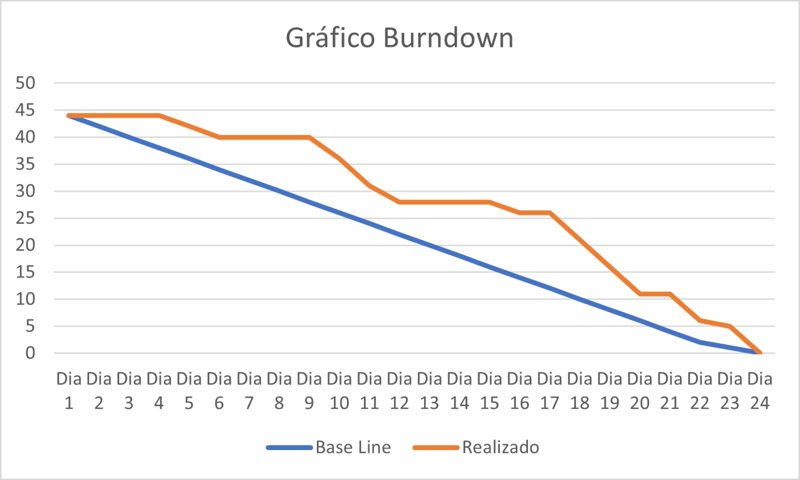
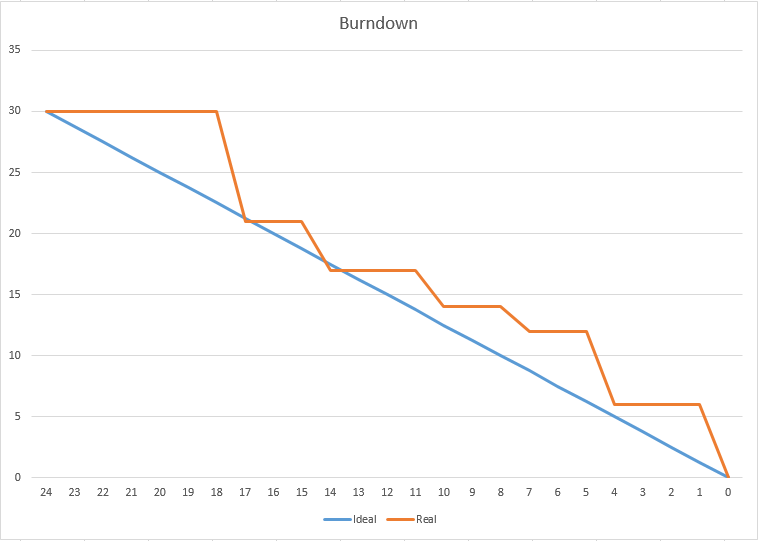
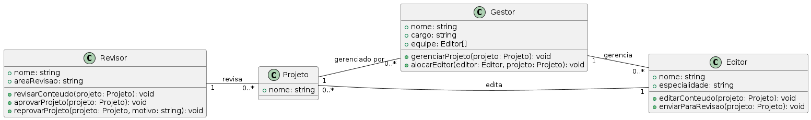
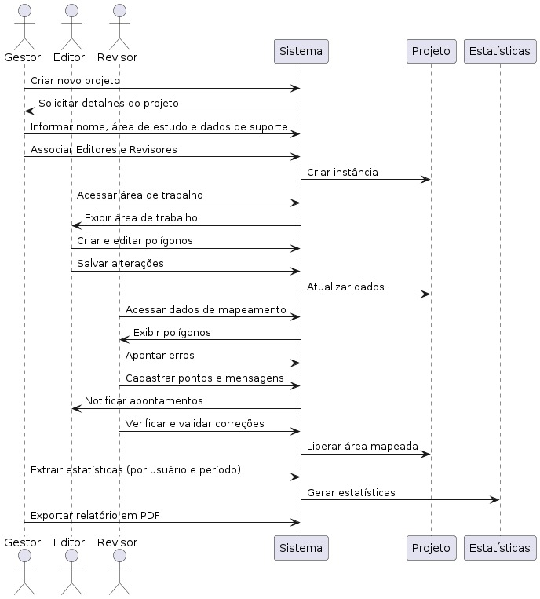
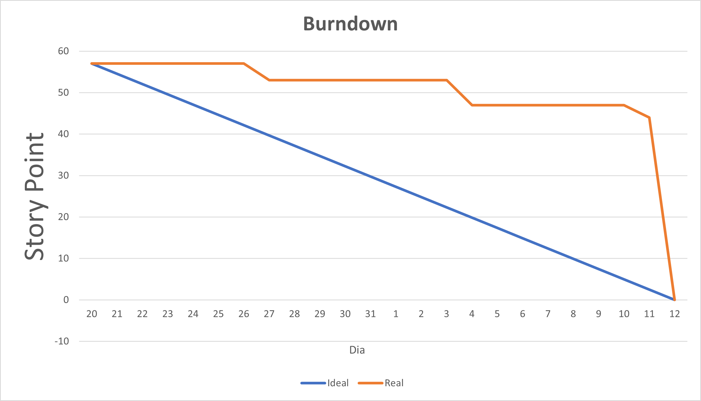

<h1>The Code</h1>
<h2>Fatec Professor Francisco Moura, Jacareí - 2º Semestre DSM 2024</h2>
<h3>Objetivo do projeto:</h3>

Desenvolver um sistema web, com o objetivo de administrar projetos de mapeamento.

    <a href ="#objetivo">Objetivo </a>|
    <a href="#entregas">Entregas</a> | 
    <a href="#backlogs">Backlogs</a> |  
    <a href="#tecnologias">Tecnologias</a> | 
    <a href="#equipe">Equipe</a>

## 📌 Objetivo do projeto

Projeto desenvolvido por alunos do 2º semestre do curso de Desenvolvimento de Software Multiplatafora, FATEC Professor Francisco Moura em Jacareí.
Consiste na criação de um sistema web, para manipulação de projetos de mapeamento. Desenvolvido em Typescript com banco de dados em PostgreSQL.

## Como executar a aplicação:

* Figma:<a href="https://www.figma.com/file/V2loXuWRqI7bLVJjdfitWE/API2DSM?type=design&node-id=43-19&mode=design&t=CnMrLyg3e9i3gNuK-0">Clique Aqui!</a>
* Vídeo Sprint 1:<a href="https://youtu.be/igHuRpgoWJU">Clique aqui!</a>
* Vídeo Sprint 2:<a href="https://youtu.be/Pn7xGSRfj14">Clique aqui!</a>

  
###   Backlogs
#### Backlog do produto

| Requisito | Sprint |
| :----------------------------------|:--:|
|**1.Tela de Login**| 1 |
|**2.Tela de criar projetos**| 2 |
|**3.Consultas usando SQL (inserir, listar, excluir e atualizar registros das tabelas)**| 1 |
|**4.Cadastrar editor e revisor**| 1 |
|**5.Carregar o limite de um novo projeto (carregar o limite do projeto)**| 3 |
|**6.Carregar a grade de retângulos de um novo projeto**| 3 |
|**7.Gerenciamento de perfis, somente o usuário gestor poderá acessar os dados**| 3 |
|**8.Utilização de middleware para validar as rotas**| 3 |
|**9.Exportar relatório de estatística em PDF**| 2 |
|**10.Consultas SQL para filtrar por editor**| 2 |
|**11.Tela de Cadastro de Usuário**| 1 |

  
##  🎯 Entregas

| Sprint| Período | Status |
|:-----:|:----------:|:---------:|

| 01 |   21/03/2024 – 17/04/2024 | Entregue 
| 02 |   22/04/2024 – 15/05/2024 | Entregue 

#### User Story

|**Requistos**|**User Story**|
|:----------------:|:-------------------------------------:|
|**1.Tela de Login**|**"Como gestor, eu quero logar com a minha conta para acessar o sistema.**|
|**2.Tela de criar projetos**|**"Como gestor, eu quero criar novos projetos e gerenciá-los, para realizar atividades"**|
|**3.Consultas usando SQL (inserir, listar, excluir e atualizar registros das tabelas)**|**"Como gestor, eu quero modificar informações de usuário para alterar informações de usuários;"**|
|**4.Cadastrar editor e revisor**|**"Como gestor, eu quero cadastrar editor e revisor, para controlar e revisar meu trabalho"**|
|**5.Carregar o limite de um novo projeto (carregar o limite do projeto)**|**"Como gestor, eu quero possuir a habilidade de carregar um limite de projeto para limitar um novo projeto"**|
|**6.Carregar a grade de retângulos de um novo projeto**|**""Como gestor, eu quero carregar a grade de retângulos, para saber como está a delimitação de um projeto""**|
|**7.Gerenciamento de perfis, somente o usuário gestor poderá acessar os dados**|**"Como gestor,eu quero gerenciar os perfis dos meus funcionários, para acessar os dados do andamento dos serviços"**|
|**8.Utilização de middleware para validar as rotas**|**"Como gestor, eu quero validar rotas em nuvem com mais eficiência, para ter mais controle e velocidade nas rotas de serviço"**|
|**9.Exportar relatório de estatística em PDF**|**"Como gestor,eu quero conseguir exportar relatórios em PDF, para poder salvá-los, mandá-los, armazená-los e enviá-los para meus trabalhadores"**|
|**10.Consultas SQL para filtrar por editor**|**"Como gestor, eu quero filtrar consultas SQL por editor, para possuir melhor visualização e controle ao acessar o banco de dados"**|
|**11.MVP**|**"Como gestor, eu quero ter uma visão de como o produto vai ser, para saber como o produto vai funcionar"**|
|**12.Tela de Cadastro de Usuário**|**"Como gestor, eu quero  cadastrar novos usuários, para ter acesso ao sistema"**|

#### Backlog da Sprint

### Sprint 1
| Item | Funcionalidade |
| :----------------------------------|:--:|
| 1 |**WireFrame do produto**|
| 2 | **Tela de Login** |
| 3 |**Consultas usando SQL (inserir, listar, excluir e atualizar registros das tabelas)** |
| 4 | **Cadastrar editor e revisor** |
| 5 | **MVP** |
| 6 | **Tela de Cadastro de Usuário**|

### Tarefas na Sprint 

|   Tarefas  |         Story Point         |
|:-------------------------:|:-----:|
| **Pesquisa de conteúdo**| 02 |
| **WireFrame no Figma**| 04 |
|**Planning Poker**| 01 |
| **Trello** | 02 |
| **Tela de login**| 05 |
| **Consultas usando SQL**| 05 |
| **Cadastrar editor e revisor**| 05 |
| **Tela de Cadastro de usuário**| 05 |
| **MVP**| 03 |
| **Documentação no GitHub** | 05 |
| **Backlog** | 05 |
| **Fazer a apresentação** | 02 |
|||
|   **Total Story Point** | 44|
 
  

## Burndown

## Retrospectiva da Sprint 1
|O que funcionou bem| O que poderia melhorar|
|:-----------------:|:---------------------:|
| **Conseguimos cumprir com nossas metas;**|**Distribuição de tarefas;**|
|**Atendemos os requisitos da cliente.** |**Falta de objetivo;**|
|                   |**Ambiguidade;** |
|                   |**Aproveitamento do tempo.**|

 

 
 

### Sprint 2 
| Item | Funcionalidade             |
| :--: | :------------------------------------------------------- |
|  01  |**1.Apresentação via GitHub**   |
|  02  |**2.Tela de criar projetos**|
|  03  |**3.Planning Poker**|
|  04  |**4.Trello**|
|  05  |**5.Burndown**|
|  06  |**6.Interface do Editor e revisor**|

### Tarefas na Sprint 
|   Tarefas  |         Story Point         |
:-------------------------:|:-----:|
| **Utilização de middleware para validar rotas**| 06 |
|**Consultas SQL para filtrar por editor**| 04 |
|**Organização do código que faz o CRUD em classes** | 03 |
| **Agrupar o código em pacotes e módulos** | 02 |
| **Aplicar técnicas para otimização de algoritmos** | 06 |
| **Front tela de criar projetos**| 09 |
|||
|   **Total Story Point** | 30 |

## Burndown

 

### Sprint 3 
| Item | Funcionalidade             |
| :--: | :------------------------------------------------------- |
|  01  |**1.Carregar o limite de um novo projeto (carregar o limite do projeto)**   |
|  02  |**2.Carregar a grade de retângulos de um novo projeto**|
|  03  |**3.Gerenciamento de perfis, somente o usuário gestor poderá acessar os dados**|
|  04  |**4.Utilização de middleware para validar as rotas**|

### Tarefas na Sprint 
|   Tarefas  |         Story Point         |
:-------------------------:|:-----:|
| **Algoritmos de ordenação**| 03 |
|**Consulta SQL para gerar estatística de quantidade de polígonos mapeados, quantidade de correções e de área de polígonos mapeados, quantidade de correções e de área de polígonos mapeados por editor**| 04 |
|**Carregar o limite de um novo projeto** | 09 |
| **Carregar a grade de retângulo de um novo projeto (Carregar o limite do projeto)** | 09 |
| **Diagrama UML de classes** | 06 |
| **Gerenciamento de perfis, somente o usuário gestor poderá acessar os dados**| 05 |
| **Utilização adequada de Gráficos cartesianos no desenvolvimento de sistemas e/ou gerenciamento de projeto**| 06 |
| **Utilização de middleware para validar as rotas**| 06 |
| **Otimização de algoritmos com utilização de memória cache**| 09 |
|||
|   **Total Story Point** | 57 |

### UML de Classe

### UML de Sequência

## Burndown

## Retrospectiva da Sprint 3
|O que funcionou bem| O que poderia melhorar|
|:-----------------:|:---------------------:|
| **Atender aos requisitos da cliente;**|**Aproveitamento do tempo;**|
| **Conseguimos cumprir com nossas Tarefas;**|**Entendimento do Projeto.**|
|**Comprometimento da Equipe;** |**Aproveitamento do tempo;** |

## Tecnologias utilizadas   
* 
* 
* 
* 
* 
* 

## Equipe

|    Função   |  Nome    |    GitHub     |
| :----------: | :-----------------------|:------------------------------------------: |
|   Product Owner| Vitor Cezar de Souza|[GitHub](https://github.com/vooshybee)|
|   Scrum Master| Ana Júlia Tette Lopes Afonso |[GitHub](https://github.com/AnaBarbancho)|
|   Dev Team|  André Flávio de Oliveira|[Github](https://github.com/andreflavio)|
|   Dev Team|  Marcelly Cristini Santos de Souza|[GitHub](https://github.com/Marcelly-cris)|
|   Dev Team|  Mauro do Prado Santos|[GitHub](https://github.com/omaurosantos)|
|   Dev Team|  Samuel Lucas Vieira de Melo|[GitHub](https://github.com/SamuelLucasVieira)|
